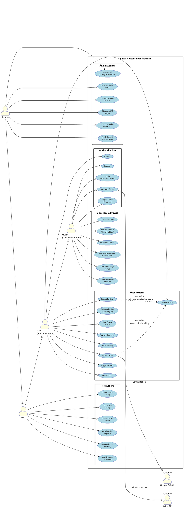
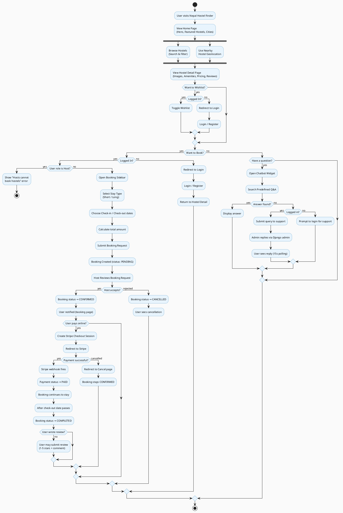
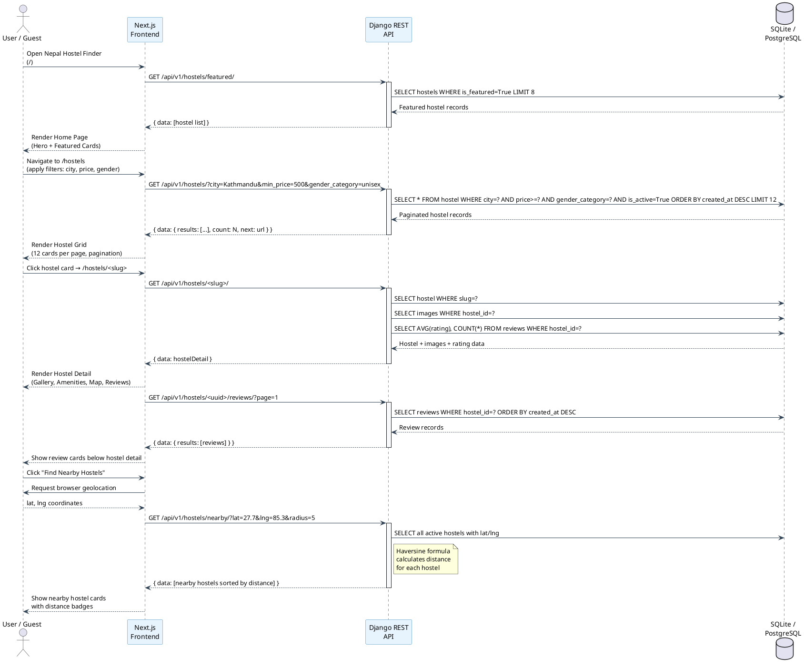
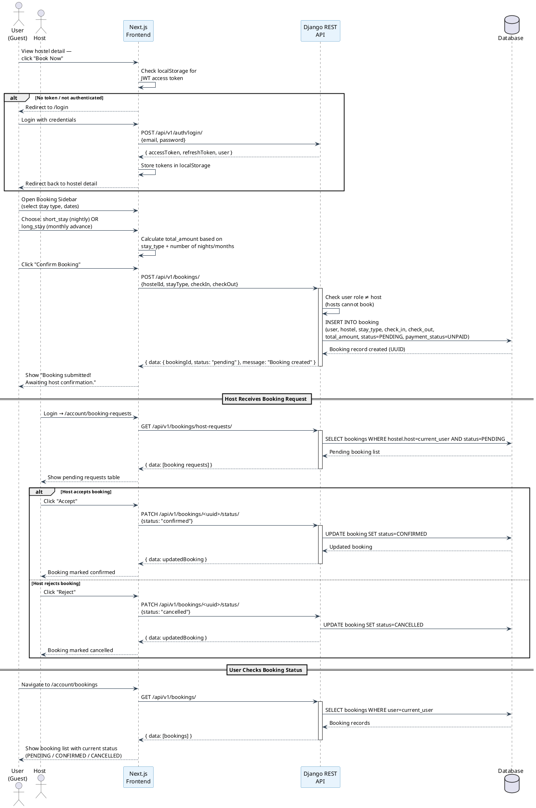
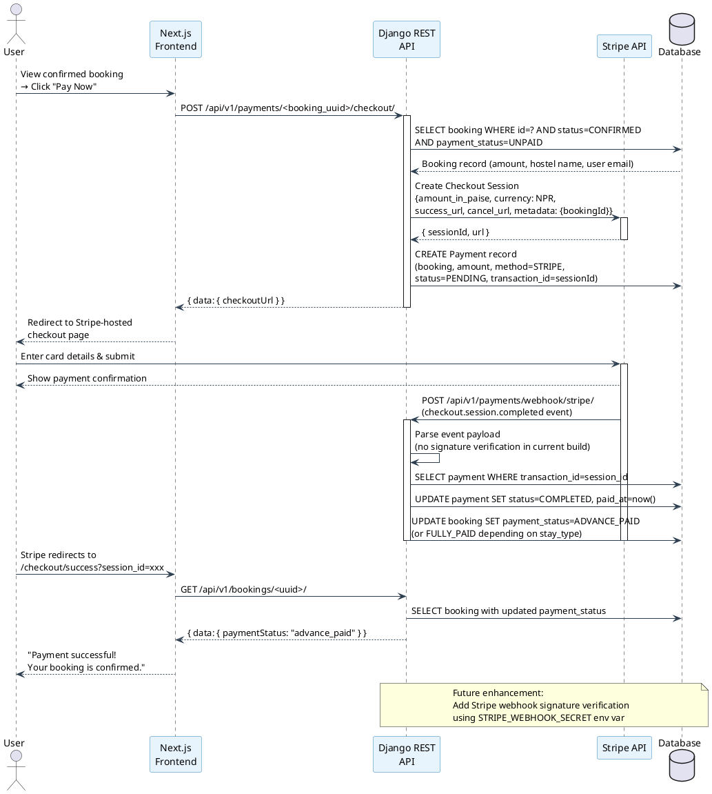
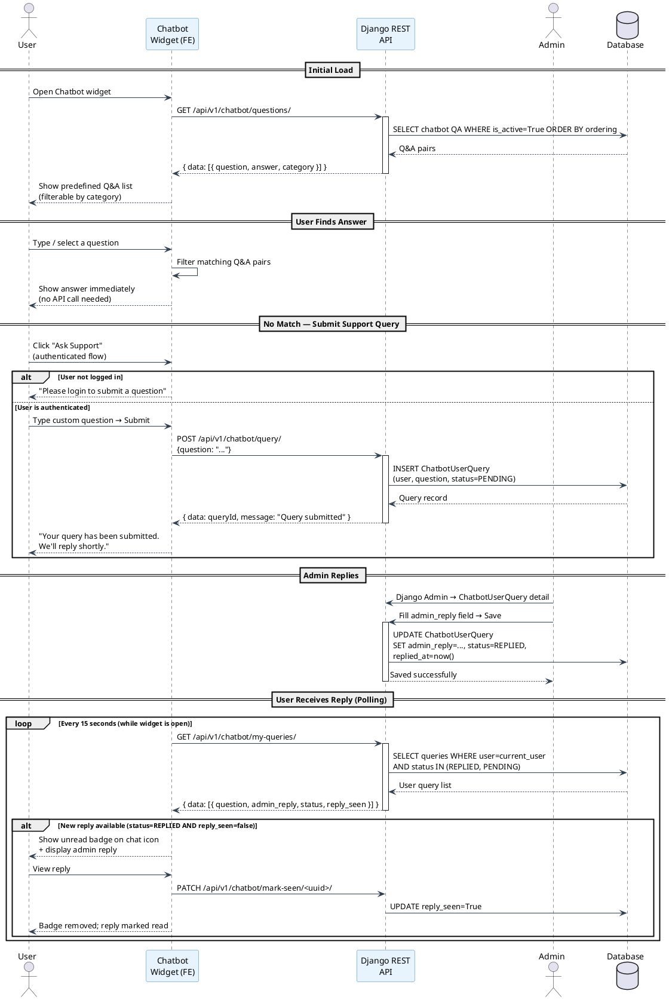
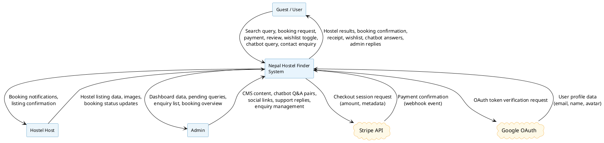
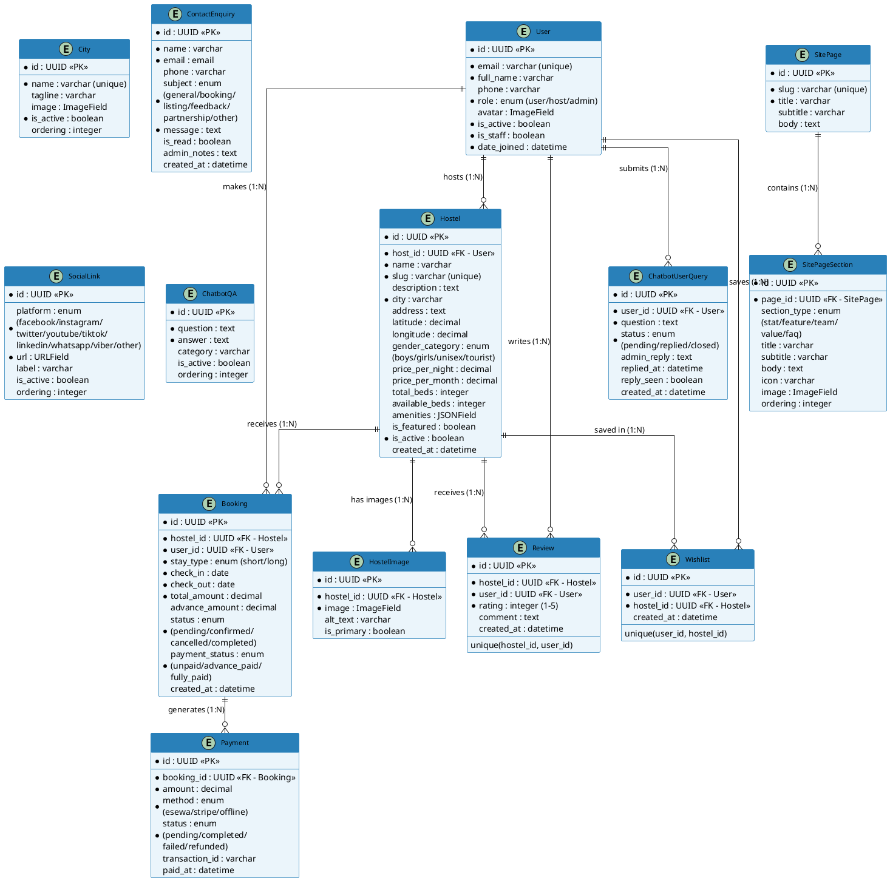

# Nepal Hostel Finder — Project Report

---

## TABLE OF CONTENTS

- [LIST OF FIGURES](#list-of-figures)
- [LIST OF ABBREVIATIONS](#list-of-abbreviations)
- [CHAPTER I: INTRODUCTION](#chapter-i-introduction)
  - [1.1 Background of the Project](#11-background-of-the-project)
  - [1.2 Issue/Problem of the Organization](#12-issueproblem-of-the-organization)
  - [1.3 Objective of Report](#13-objective-of-report)
  - [1.4 Review of Work and Literature](#14-review-of-work-and-literature)
  - [1.5 Development Methodology](#15-development-methodology)
  - [1.7 Report Organization](#17-report-organization)
- [CHAPTER II: SYSTEM DEVELOPMENT PROCESS](#chapter-ii-system-development-process)
  - [2.1 Analysis](#21-analysis)
  - [2.2 Requirement Specification](#22-requirement-specification)
  - [2.3 Methodology Analysis](#23-methodology-analysis)
  - [2.4 System Design](#24-system-design)
  - [2.5 System Implementation](#25-system-implementation)
  - [2.6 Findings](#26-findings)
- [CHAPTER III: DISCUSSION AND CONCLUSION](#chapter-iii-discussion-and-conclusion)
  - [3.1 Summary](#31-summary)
  - [3.2 Conclusion](#32-conclusion)
  - [3.3 Recommendations](#33-recommendations)
- [REFERENCES](#references)
- [BIBLIOGRAPHY](#bibliography)
- [APPENDICES](#appendices)

---

## LIST OF FIGURES

| Figure | Title |
|--------|-------|
| Fig 1.1 | Incremental Model |
| Fig 2.1 | Use Case Diagram |
| Fig 2.2 | System Flowchart |
| Fig 2.3 | Hostel Browsing & Search Sequence Diagram |
| Fig 2.4 | Booking Creation Sequence Diagram |
| Fig 2.5 | Stripe Payment Sequence Diagram |
| Fig 2.6 | Chatbot Query Sequence Diagram |
| Fig 2.7 | Level 0 Data Flow Diagram |
| Fig 2.8 | Level 1 Data Flow Diagram |
| Fig 2.9 | Entity Relationship Diagram |

---

## LIST OF ABBREVIATIONS

| Abbreviation | Full Form |
|---|---|
| API | Application Programming Interface |
| CSS | Cascading Style Sheets |
| DFD | Data Flow Diagram |
| Django | High-level Python Web Framework |
| DB | Database (SQLite / PostgreSQL) |
| ER | Entity Relationship |
| HTML | Hypertext Markup Language |
| JS | JavaScript |
| JWT | JSON Web Token |
| IDE | Integrated Development Environment |
| NPR | Nepalese Rupees |
| ORM | Object-Relational Mapping |
| REST | Representational State Transfer |
| SQL | Structured Query Language |
| SSR | Server-Side Rendering |
| TS | TypeScript |
| UI | User Interface |
| UML | Unified Modeling Language |
| UUID | Universally Unique Identifier |

---

## CHAPTER I: INTRODUCTION

### 1.1 Background of the Project

The **Nepal Hostel Finder** platform is a comprehensive full-stack web application developed to digitally transform the hostel discovery, booking, and management experience in Nepal. The project addresses the growing demand for structured, reliable hostel accommodation among students, trekkers, workers, and tourists who seek affordable yet comfortable lodging across the country.

Nepal's accommodation market — particularly the hostel segment — has historically relied on word-of-mouth referrals, social media posts, and fragmented listings spread across multiple uncoordinated platforms. This creates friction for guests searching for suitable accommodation and equally burdens hostel owners who lack centralized tools to manage their listings, track bookings, and receive payments.

The platform serves three distinct user roles:

- **Guests (Users)**: Search, filter, wishlist, and book hostels with integrated online payment
- **Hosts**: Register and manage hostel listings, upload images, and handle incoming booking requests
- **Administrators**: Manage all platform content via a comprehensive admin dashboard, moderate chatbot Q&A, respond to support queries, and configure social media links and CMS pages

The platform integrates modern web technologies including **Next.js 16** (React-based frontend with App Router), **Django REST Framework** (backend API), **Stripe** payment processing in Nepalese Rupees (NPR), **Google OAuth** for social login, and a floating **AI-assisted Chatbot** widget supported by an admin-managed Q&A database.

---

### 1.2 Issue/Problem of the Organization

Through analysis and stakeholder research, the following key challenges in Nepal's hostel accommodation sector were identified:

- **No Centralized Discovery Platform**: Guests rely on scattered social media posts, phone calls, or walk-ins to find hostels, with no reliable filtering by location, price, gender policy, or amenities
- **Manual Booking Processes**: Hostel owners receive booking requests over phone or WhatsApp without any formal tracking, confirmation workflow, or payment collection mechanism
- **Lack of Online Payment Infrastructure**: No integrated payment system for advance booking deposits or full payments; cash-only operations create trust and logistics issues
- **No Verified Review System**: Guests cannot read verified reviews from past guests, and hostel owners have no way to build digital credibility
- **Poor Visibility for Hostel Owners**: Small and mid-sized hostels struggle to establish digital presence against larger hotels and OTA-listed properties
- **No Role-Separated Management Tools**: Hosts lack dedicated dashboards to manage listings and bookings, while admins have no structured backend to moderate platform content
- **Absence of Geolocation Features**: No tools to help guests find hostels near their current location or planned destination
- **Unstructured Customer Support**: No system for handling guest queries, complaints, or general support requests

---

### 1.3 Objective of Report

#### 1.3.1 Primary Objectives

- **Digital Discovery**: Create a searchable, filterable hostel directory for Nepal with real data managed by hostel hosts
- **Booking System**: Implement a complete booking workflow from request to confirmation to payment, supporting both short stays (nightly) and long stays (monthly)
- **Payment Integration**: Enable secure online payments via Stripe in NPR with booking status management
- **Role-Based Access**: Provide distinct workflows for guests, hostel hosts, and platform administrators
- **Review & Trust System**: Allow verified guests (those who have completed a stay) to leave star ratings and comments

#### 1.3.2 Secondary Objectives

- **Operational Efficiency**: Reduce manual coordination between guests and hostel owners through automated booking and notification workflows
- **Geolocation Discovery**: Enable nearby hostel search using live geolocation (Haversine-based distance calculation)
- **CMS-Driven Content**: Allow admins to manage the About page, team sections, stats, and FAQs without code changes
- **Customer Support via Chatbot**: Provide instant Q&A via a floating chatbot and a human-in-the-loop fallback for complex queries
- **Wishlist Feature**: Allow guests to save preferred hostels for future reference
- **Social Media Integration**: Maintain a live, admin-configurable social media sidebar across the platform

---

### 1.4 Review of Work and Literature

#### Nepal's Hostel & Accommodation Sector

Nepal's tourism and student migration sectors create a consistent demand for affordable, shared accommodation. The growth of universities in Kathmandu, Pokhara, and Chitwan has created a large student population seeking hostels, while trekking and tourism drive demand in hill regions. Despite this demand, digital tools for hostel booking remain limited — most operations remain informal.

#### Global Hostel Booking Platforms

Global platforms like Hostelworld and Booking.com demonstrate the commercial viability of aggregating hostel listings with search, reviews, and online payment. However, these platforms cater primarily to international tourists and carry high commission fees that local Nepali hostel operators cannot afford. A locally-focused, low-friction platform represents a clear market gap.

#### Full-Stack Web Development Best Practices

- **Decoupled Architecture**: Separating Django REST API from Next.js frontend enables independent scaling and clear separation of concerns
- **JWT Authentication**: Stateless token-based authentication is well-suited to single-page application architectures
- **Role-Based Permissions**: Django REST Framework's permission classes allow clean enforcement of host vs. user vs. admin access patterns
- **Responsive Design**: Tailwind CSS utility classes enable rapid mobile-first UI development that works across all device types
- **Serverless-Ready Frontend**: Next.js with App Router supports static and server-side rendering strategies for optimal performance

---

### 1.5 Development Methodology

Methodology is a structured framework that outlines the methods, procedures, and techniques used to achieve objectives and ensure consistent, reliable results.

#### 1.5.1 Project Framework

Nepal Hostel Finder follows a **hybrid Incremental + Agile** development model:

**Incremental Model Benefits:**
- Platform requirements are divided into independently deliverable modules
- Each increment undergoes a full development lifecycle (analysis → design → implement → test)
- Risk is reduced through staged delivery; critical features (auth, listings, booking) are prioritized
- Enables early testing and stakeholder feedback on core functionality

**Agile Practices:**
- Short 2-week development sprints
- Regular review of completed features against requirements
- Adaptive priority adjustments based on sprint outcomes
- Continuous integration of tested modules into a working system

**Key Increments Delivered:**

| Sprint | Increment | Features |
|--------|-----------|---------|
| 1 | Core Infrastructure | Project setup, auth system (JWT + Google OAuth), user model, Navbar, Footer |
| 2 | City & Hostel Listings | City management, hostel CRUD with image upload, search, filter, pagination |
| 3 | Booking System | Booking creation, host dashboard, booking status management, host/user separation |
| 4 | Payments | Stripe Checkout integration, NPR currency, webhook handler, payment tracking |
| 5 | Reviews & Wishlist | Star rating system, eligibility checks, wishlist toggle, nearby hostel geolocation |
| 6 | CMS & Support | About CMS page, contact form, chatbot Q&A widget, admin reply system, social sidebar |

> **Fig 1.1** — Incremental Model diagram illustrating the above sprint progression

#### 1.5.2 Data and Information

**Primary Data**: Collected through direct analysis of hostel operational requirements, observation of manual booking workflows, and identification of gaps through stakeholder review.

**Secondary Data**: Referenced from official documentation for Django REST Framework, Next.js, Stripe API, and Google OAuth. Global hostel booking platform patterns (Hostelworld, Booking.com) were analyzed for UX and feature benchmarking.

---

### 1.7 Report Organization

This report is structured into three main chapters:

**Chapter I: Introduction**
- Project background and Nepal accommodation context
- Problem statement and organizational challenges
- Primary and secondary objectives
- Literature review and methodology

**Chapter II: System Development Process**
- System analysis and possible solutions
- Functional and non-functional requirements
- Use Case Diagram, System Flowchart, Sequence Diagrams, DFD, ER Diagram
- Tools used and unit testing

**Chapter III: Discussion and Conclusion**
- Summary of outcomes
- Conclusions and recommendations for future development

---

## CHAPTER II: SYSTEM DEVELOPMENT PROCESS

### 2.1 Analysis

#### 2.1.1 Analysis of Task

The Nepal Hostel Finder system is a multi-role web platform that handles the complete lifecycle of hostel accommodation: discovery, booking, payment, and post-stay review. The system task can be broken down as:

1. **Content Layer**: Hostel listings, city directories, images, amenities, and CMS pages are served to the public without authentication
2. **Transactional Layer**: Booking creation, payment processing, and wishlist management require user authentication
3. **Management Layer**: Hosts manage their listings and bookings; admins manage all platform data
4. **Support Layer**: The chatbot provides instant answers, with human-in-the-loop fallback via admin replies

The backend exposes a RESTful API (Django REST Framework) consumed exclusively by the Next.js frontend. All API responses follow a consistent `{ data, message }` envelope pattern with camelCase field names.

#### 2.1.2 Problem and Issue

| Problem Area | Current State | Impact |
|---|---|---|
| Hostel Discovery | Manual or word-of-mouth search | Guests miss suitable options; high friction |
| Booking Management | Phone/WhatsApp-based | No tracking, confirmation, or records |
| Payment Collection | Cash only | Booking uncertainty, no advance deposits |
| Host Visibility | No centralized listing tools | Hosts cannot showcase their properties |
| Review System | Absent or unverified | No trusted social proof for guests |
| Customer Support | No structured channel | Unresolved queries, poor guest experience |
| Geolocation | Not available | Guests cannot find hostels near destinations |

#### 2.1.3 Analysis of Possible Solutions

Three architectural approaches were considered:

**Option A — Third-party OTA Integration (Rejected)**
Listing hostels on existing OTA platforms (Booking.com, Airbnb) as a marketplace seller. Rejected due to high commission fees, lack of Nepal-specific features (NPR payment, eSewa), and inability to customize guest-host workflows.

**Option B — Static Website with Manual Contact (Rejected)**
A simple static listing website with contact forms. Rejected because it fails to automate bookings, payments, or reviews, and provides no host-side management tools.

**Option C — Custom Full-Stack Platform (Selected)**
A purpose-built Django REST + Next.js application with:
- Role-based JWT authentication
- Dynamic hostel listings with host management
- Integrated Stripe payments in NPR
- Automated booking lifecycle management
- Verified review system
- Admin-controlled CMS and chatbot

This option was selected for its complete coverage of all identified problem areas.

---

### 2.2 Requirement Specification

The Nepal Hostel Finder platform is designed to serve as a comprehensive digital ecosystem for hostel discovery, booking, and management. The system enables guests to explore hostels, make reservations, process online payments, and share reviews, while providing hostel owners and administrators with powerful management tools to operate their businesses efficiently.

The requirements are categorized into functional and non-functional specifications as outlined below:

#### 2.2.1 Functional Requirements

Functional requirements specify the essential tasks and features that the Nepal Hostel Finder platform must perform, including hostel discovery, booking management, payment processing, review systems, and administrative capabilities. These requirements define the core features that developers must implement to enable users and hosts to accomplish their objectives effectively.

**A. Guest Discovery and Browsing Features:**

Guests interact with the platform primarily through hostel discovery workflows. The system must enable comprehensive hostel browsing with advanced filtering capabilities by city, gender category (boys-only, girls-only, unisex, tourist-friendly), price range (per night or per month basis), number of beds, and specific amenities (WiFi, kitchen, hot water, lockers, etc.). Beyond static listing presentation, the platform must support full-text search across hostel names, descriptions, and locations to help guests find exactly what they seek. The nearby hostel finder using geolocation represents a critical feature for tourists and travelers who need accommodation near their current position, calculated using the Haversine distance formula for accuracy.

**B. Authentication and User Management:**

The platform must support multiple authentication methods to lower barriers to entry. Email/password registration with secure password hashing is the primary authentication method, complemented by Google OAuth integration for seamless single sign-on. Password reset functionality with secure token-based email verification ensures users can recover access to their accounts. User profiles must be manageable, allowing guests to update personal information, upload avatars, and track their booking history and wishlists from a centralized dashboard.

**C. Booking Lifecycle Management:**

The booking system must support two distinct stay types with different pricing and payment models: short-stay bookings (nightly rates, full payment required) and long-stay bookings (monthly rates, advance payment for one month). The booking creation workflow requires guests to select a hostel, specify check-in and check-out dates, and submit a booking request. Hosts receive notifications of pending bookings via the platform and can accept, reject, or negotiate terms. Once confirmed, bookings transition to CONFIRMED status, unlocking payment options.

**D. Payment Processing:**

The payment system must integrate with Stripe to accept credit/debit card payments in Nepalese Rupees (NPR), the local currency crucial for domestic operations. The platform must create Stripe Checkout Sessions with the booking amount, handle successful payment webhooks that update payment statuses, and maintain detailed payment transaction logs for both guests and admins. The payment system must enforce that full payment is completed before a booking is activated.

**E. Verified Review System:**

To build trust and provide social proof, authenticated guests who have completed a booking (check-out date has passed) must be able to submit star ratings (1-5 stars) and written comments for each hostel. The system must prevent duplicate reviews (one review per user per hostel) and implement optional admin moderation if needed. Hostel detail pages must display aggregated ratings and individual reviews to help prospective guests make informed decisions.

**F. Wishlist and Saved Preferences:**

Authenticated guests must be able to save hostels to a personal wishlist for later consideration. The wishlist system must support toggle operations (add/remove) and provide quick access to saved listings from a dedicated page. This feature helps guests organize their search across multiple visits and facilitates longer consideration cycles.

**G. Hostel Host Management:**

Hosts (users with role=host) must have dedicated dashboards to manage their hostel listings. Hosts can create new hostel listings by providing details: name, description, location (city, address, coordinates), gender category, pricing (per-night and per-month rates), total bed count, amenities (as JSON array), and upload multiple images with one designated as primary. Hosts can edit existing listings to update pricing, amenities, or descriptions. Soft-deletion (is_active=False) allows hosts to temporarily delist without losing historical data. Hosts must view all booking requests for their hostels and manage booking status transitions (pending → confirmed or rejected; confirmed → completed).

**H. Content Management System (CMS):**

Admins must be able to manage dynamic website content without code deployment. The About page and other CMS pages must be editable via the Django admin interface using SitePage and SitePageSection models. Sections support multiple content types (stats, features, team member bios, values, FAQs) with customizable icons, images, and ordering, enabling admins to tell the company's story and build trust.

**I. Chatbot and Customer Support:**

The chatbot widget must display admin-defined Q&A pairs (questions, answers, categories) that are instantly searchable by guests. For queries not matching predefined answers, authenticated guests must be able to submit support questions that are stored in the database. Admins receive these queries in the Django admin and can reply with detailed answers. Guests are notified via 15-second polling when admin replies are available, and can mark replies as read.

**J. Social Media and Contact:**

A sticky sidebar must display admin-configured social media links (Facebook, Instagram, Twitter, YouTube, TikTok, LinkedIn, WhatsApp, Viber) with platform-specific styling. An unauthenticated contact form allows any visitor to submit inquiries with name, email, phone, subject category (general, booking, listing, feedback, partnership, other), and message. Admins receive these enquiries in the Django admin and can mark them as read with optional notes.

---

#### 2.2.2 Use Case Diagram

A Use Case Diagram illustrates the interactions between the Nepal Hostel Finder platform and its primary actors—guests, authenticated users, hosts, and administrators. The diagram demonstrates how different user roles interact with various system functions, providing a clear overview of user roles and system capabilities. Use cases capture the different ways users can interact with the system to achieve their goals.

The diagram visualizes functional dependencies: for example, "Submit Review" includes "Create Booking" (a user must have booked before reviewing), and "Pay via Stripe" is linked to "Create Booking" (payment is conditional on an existing booking).

**Key Actors:**

- **Guest (Unauthenticated User)**: End-users who explore hostels, learn about the platform, and register for accounts
- **User (Authenticated)**: Guests who have registered and can make bookings, payments, and submit reviews
- **Host**: Registered hostel owners who create and manage listings, handle booking requests
- **Admin**: Platform administrators with full Django admin access to manage all content and moderate user interactions
- **Stripe API**: External payment processor for checkout sessions and webhooks
- **Google OAuth**: External service for social login verification

> **Fig 2.1** — Use Case Diagram [PlantUML code provided above]

---

#### 2.2.3 Non-Functional Requirements

Non-functional requirements define how the Nepal Hostel Finder platform should perform, focusing on quality attributes such as performance, usability, security, reliability, and scalability. These requirements ensure the system meets professional standards, provides excellent user experience, and can sustain growth over time.

**A. Performance Requirements:**

The platform must load pages within 3 seconds on standard internet connections (3G/4G) to prevent user abandonment. API endpoints must respond to list requests (hostels, bookings, etc.) in under 300 milliseconds by implementing efficient database queries with proper indexing. Image files must be optimized for web delivery (JPEG compression, WebP format conversion) to minimize page load times. Pagination with a limit of 12 items per page prevents excessive data transfer in list responses. The frontend must implement skeleton loaders and lazy loading for images to provide visual feedback during data fetches.

**B. Availability and Reliability:**

The platform should maintain 99% uptime during business hours with graceful degradation in case of partial failures. Automated database backups must be configured daily  to prevent data loss. The authentication system must handle token refresh transparently without requiring users to login repeatedly. API responses must follow a consistent `{ data, message }` envelope pattern, and appropriate HTTP status codes must be used (400 for validation errors, 401 for auth failures, 404 for not found, 500 for server errors).

**C. Usability and User Experience:**

The interface must be intuitive and follow modern web design principles with clear visual hierarchy, logical navigation, and accessibility compliance (WCAG 2.1 AA). Responsive design must work seamlessly across mobile (320px+), tablet (768px+), and desktop (1024px+) devices. Form validation must provide immediate, specific feedback (not just generic "error" messages). The navigation must be persistent and accessible from any page, with clear indicators of the current location in site hierarchy.

**D. Security Requirements:**

All data transmission must use HTTPS encryption. Authentication must use JWT tokens with appropriate expiration times (60-minute access tokens, 7-day refresh tokens) and secure storage in httpOnly cookies or localStorage. Password reset tokens must be single-use and expire after 24 hours. User inputs must be validated and sanitized at both frontend and backend to prevent XSS and injection attacks. Hostel hosts can only edit their own listings; hosts cannot access other hosts' data. The Stripe webhook must implement signature verification before processing payment events.

**E. Scalability Requirements:**

The architecture must support horizontal scaling as user volume increases. The database must maintain query performance even as the number of hostels and bookings grows. Django ORM relationships and appropriate indexing (on foreign keys, frequently-queried fields like is_active, created_at) enable efficient data retrieval. Frontend can be deployed on CDN for global distribution; backend can scale independently on additional servers behind a load balancer.

**F. Consistency Requirements:**

All API response field names must be in camelCase (snake_case from Django models is converted by serializers). All date responses must use ISO 8601 format with timezone information. Enum values (booking status, payment method) must be consistent across frontend and backend. Database constraints (unique together, foreign key relationships) must enforce data integrity at the database level.

**G. Maintainability and Extensibility:**

CMS-driven content (About page, social links, chatbot Q&A) must be updatable without code deployment. The admin interface (enhanced with Jazzmin) must provide intuitive CRUD operations for all models. Code must follow PEP 8 (Python) and ESLint (JavaScript) standards for consistency. API versioning (/api/v1/) allows future API changes without breaking existing clients.

---

#### 2.2.4 (Continuation) Functional Requirements — Detailed Specifications

> [Functional requirements table recap]

| User Role | Key Capabilities |
|-----------|------------------|
| **Guest (Unauthenticated)** | Browse hostels, search/filter, view details, read reviews, access CMS pages, contact via form, chatbot access, register, login |
| **User (Authenticated)** | All guest features + create/view/cancel bookings, pay online, wishlist, submit reviews (if eligible), support queries, view admin replies |
| **Host** | All user features (except booking) + create/edit/delete hostel listings, upload images, view booking requests, accept/reject/complete bookings |
| **Admin** | Full Django admin access to all models and moderation workflows |

---

#### 2.2.5 Feasibility Study

A comprehensive feasibility study evaluates whether the Nepal Hostel Finder platform can be successfully developed, implemented, and maintained within specified constraints. The study examines technical viability, operational practicality, and economic sustainability to ensure the platform delivers measurable value to both guests and hostel owners.

**A. Technical Feasibility**

Technical feasibility confirms the availability of suitable technologies, development expertise, and integration capabilities for implementing the platform. The Nepal Hostel Finder leverages proven, production-grade technologies:

- **Django REST Framework**: A mature, well-documented Python web framework with built-in authentication, serialization, and permission classes. The framework is actively maintained by the Django Software Foundation with extensive community support.
- **Next.js**: A React framework with App Router providing server-side rendering, static generation, and optimized production builds. Next.js has become the industry standard for React applications and benefits from strong Vercel backing and ecosystem support.
- **PostgreSQL**: A robust, open-source relational database with full ACID compliance, supporting complex queries and geographic data types (PostGIS) for future location-based features.
- **Stripe API**: A stable, well-documented payment processor with comprehensive SDKs, supporting NPR currency and webhook-based event handling.
- **Google OAuth**: OAuth 2.0 integration with mature libraries like `@react-oauth/google` and comprehensive documentation.

All selected technologies are open-source or have generous free tiers, eliminating excessive licensing costs. The development team possesses expertise in full-stack web development with Django and React/Next.js, having delivered similar projects. Integration with third-party services (Stripe, Google, SMTP) is well-established with clear documentation and sandbox/test environments for safe development.

**Conclusion**: The technical stack is fully mature and proven. No experimental or immature technologies are in the critical path. Risk is low.

**B. Operational Feasibility**

Operational feasibility assesses whether all stakeholders (guests, hosts, admins) can effectively adopt and utilize the platform without requiring extensive training or operational overhead.

**For Guests**: The platform mimics familiar web patterns used by booking.com, Airbnb, and travel sites. Guests intuitively understand how to search, filter, and book. Session management via JWT is transparent; token refresh prevents unexpected logouts. Password reset via email is a standard pattern.

**For Hostel Hosts**: The host dashboard mirrors admin interfaces used in content management systems, requiring minimal training. Creating a hostel listing is a straightforward form submission with optional image uploads. Booking request management uses familiar accept/reject patterns.

**For Administrators**: The Django admin interface (enhanced with Jazzmin) provides a professional backend for content management. While CMS pages, chatbot Q&A, and social links require Django admin access (not a web UI), these features are modified infrequently and admins can receive training during deployment.

The platform supports existing hostel workflows while introducing efficiency improvements through automation and centralized information. No hostel needs to "reinvent" how they operate; the system enhances their existing practices.

**Conclusion**: Operational adoption risk is low. User-centric design and familiar interaction patterns ensure smooth adoption.

**C. Economic Feasibility**

Economic feasibility evaluates development costs, operational expenses, and return on investment (ROI).

**Development Costs**: Reasonable, as the project uses established frameworks without custom infrastructure needs. No AI/ML models, geospatial databases, or complex microservices architectures are required for initial launch.

**Operational Costs** (monthly):
- **Hosting**: Django backend on affordable cloud platforms (Heroku, DigitalOcean, AWS) — ~$50-200/month
- **Frontend Hosting**: Vercel free tier supports reasonable traffic; $20+/month for increased usage
- **Database**: PostgreSQL on managed cloud service — ~$15-50/month
- **Email Service**: Gmail SMTP (free) or SendGrid sandbox tier for development
- **Stripe Fees**: 2.9% + $0.30 per transaction (industry standard; reduces with volume)
- **Domain & SSL**: ~$12-15/year; included in most hosting packages
- **Total**: ~$100-300/month for moderate traffic

**Revenue Model Options** (not implemented initially):
- Commission on bookings (1-3% — lower than Booking.com's 15% attracts hosts)
- Freemium model: hosts pay for featured listings
- Advertising from service partners

**Benefits/ROI**:
- **For Guests**: Reduced friction finding and booking hostels; transparent pricing; verified reviews
- **For Hosts**: Digital visibility without paying Booking.com/Airbnb commissions; direct bookings; operational tracking
- **For Platform**: Lower operational costs compared to traditional OTA models (no support staff needed for basic inquiries due to chatbot); scalable revenue potential

**Conclusion**: The platform is economically viable as a MVP with straightforward monetization paths as it scales.

---

#### 2.2.6 System Analysis

Traditional hostel booking in Nepal relies on physical walk-ins, word-of-mouth referrals, social media messages (WhatsApp, Facebook), and phone calls. This approach has critical limitations:

- **Information Fragmentation**: Hostel details scattered across WhatsApp statuses, Facebook posts, Google Maps, and website reviews (if they exist) — no single source of truth
- **Manual Processes**: Booking confirmation via text messages, no formal payment tracking, payment via bank transfer or cash-on-arrival
- **Inefficiency**: Hostel owners spend time responding to duplicate inquiries; guests waste time calling multiple hostels; no automated confirmation workflows
- **Trust Issues**: No verified reviews; guests cannot assess hostel quality beyond photos sent via WhatsApp; hosts have no feedback mechanism
- **Limited Discoverability**: Guests relying on luck or network effects to find suitable hostels; no geographic or amenity-based search
- **No Analytics**: Hosts have no data on enquiry sources, popular dates, or customer preferences

The Nepal Hostel Finder addresses these limitations by providing a comprehensive digital ecosystem that:

1. **Centralizes Hostel Information**: Single, authoritative source for each hostel's description, amenities, pricing, images, and location
2. **Enables Efficient Booking**: Standardized booking creation with instant confirmation, clear status tracking, and online payment options
3. **Builds Trust Through Reviews**: Verified reviews from guests with completed stays; aggregated ratings visible to prospects
4. **Supports Host Operations**: Dedicated dashboard for managing listings, viewing bookings, accepting/rejecting requests without leaving the platform
5. **Automates Support**: Chatbot handles common questions instantly; human support available for complex inquiries
6. **Provides Analytics Foundation**: Booking data, review patterns, and search behavior inform future features and marketing

This digital-first approach transforms Nepal's hostel market from an informal, fragmented ecosystem to a structured, efficient one. Guests find their ideal hostel faster; hosts operate more efficiently; the platform can scale to serve thousands of properties and hundreds of thousands of bookings.

---

#### 2.2.2 Use Case Diagram

> **Fig 2.1** — See PlantUML code below



#### 2.2.3 Non-Functional Requirements

| Category | Requirement |
|---|---|
| **Performance** | API responses under 300ms for list endpoints; paginated results (12 per page) to avoid large payloads |
| **Security** | JWT-based stateless auth; auto-logout on 401; password reset via secure tokens; CORS restricted to frontend origin |
| **Scalability** | SQLite for development; PostgreSQL-ready for production; Django ORM provides DB-agnostic queries |
| **Usability** | Mobile-first responsive design with Tailwind CSS; accessible color contrast; skeleton loaders during data fetch |
| **Availability** | Role-based protected routes on frontend; guests redirected to login before booking |
| **Consistency** | All API responses in `{ data, message }` envelope; all field names in camelCase |
| **Maintainability** | CMS-driven About page, social links, and chatbot Q&A — admins can update without code changes |
| **Reliability** | Input validation at both serializer (backend) and form (frontend) levels; unique constraints enforced at DB level |

---

### 2.3 Methodology Analysis

The Nepal Hostel Finder followed the **Incremental Development Model** with Agile sprint practices, chosen for its ability to deliver working features progressively while allowing continuous feedback and refinement.

#### 2.3.1 Why Incremental Model?

- The platform's core features (hostel listing, booking, payments) have clear dependencies, making a staged delivery natural
- Early increments (auth + listing) could be demonstrated and tested before later increments (payments + reviews) were built
- Risk of delay in complex features (Stripe integration, geolocation) was isolated — simpler features remained releasable

#### 2.3.2 Progressive Refinement

Each sprint's output fed directly into the next:
- Sprint 1 (auth) enabled Sprint 3 (booking creation requires authenticated users)
- Sprint 2 (hostel listings) enabled Sprint 4 (payments are tied to specific bookings for specific hostels)
- Sprint 5 (reviews) requires Sprint 3 (completed bookings as eligibility gate)

This dependency chain was managed by defining API contracts (serializers + URLs) before frontend implementation in each sprint.

#### 2.3.3 Development Sprints (Incremental Model)

| Sprint | Deliverable | Backend | Frontend |
|--------|------------|---------|---------|
| Sprint 1 | Auth System | User model, JWT, Google OAuth, password reset | Login, register, forgot password, profile pages |
| Sprint 2 | Hostel Discovery | City, Hostel, HostelImage models; search/filter API | Home page, hostel listing, hostel detail pages |
| Sprint 3 | Booking System | Booking model, host/user permission classes | Booking sidebar, host dashboard, booking management |
| Sprint 4 | Payments | Payment model, Stripe Checkout, webhook | Checkout success/cancel pages, payment status |
| Sprint 5 | Social Features | Review model, Wishlist model, nearby endpoint | Review section, wishlist page, nearby hostels widget |
| Sprint 6 | CMS & Support | SitePage, SocialLink, ChatbotQA, ChatbotUserQuery | About page, social sidebar, chatbot widget, contact page |

---

### 2.4 System Design

The Nepal Hostel Finder follows a decoupled architecture:

```
┌───────────────────────────────────────────────────────┐
│           Next.js 16 Frontend (App Router)            │
│  ┌─────────────┐  ┌─────────────┐  ┌──────────────┐  │
│  │  Pages      │  │  Components │  │  API Client  │  │
│  │  (App Dir)  │  │  (Layout,   │  │  (JWT inject,│  │
│  │             │  │   Widgets)  │  │   auto-retry)│  │
│  └─────────────┘  └─────────────┘  └──────────────┘  │
└────────────────────────┬──────────────────────────────┘
                         │ HTTPS REST API (/api/v1/)
┌────────────────────────▼──────────────────────────────┐
│         Django REST Framework Backend                  │
│  ┌──────────┐ ┌────────────┐ ┌───────────────────┐   │
│  │  Views   │ │ Serializers│ │  Permission Classes│   │
│  │ (ViewSets│ │ (camelCase │ │ (IsHost,           │   │
│  │  + APIV) │ │  output)   │ │  IsHostOwner)      │   │
│  └──────────┘ └────────────┘ └───────────────────┘   │
│  ┌──────────────────────────────────────────────────┐ │
│  │            Django ORM + SQLite/PostgreSQL        │ │
│  └──────────────────────────────────────────────────┘ │
└───────────────────────────────────────────────────────┘
         │                      │
    ┌────▼─────┐         ┌──────▼──────┐
    │  Stripe  │         │  Google     │
    │ Checkout │         │  OAuth API  │
    └──────────┘         └─────────────┘
```

#### 2.4.1 System Flowchart

> **Fig 2.2** — See PlantUML code below



#### 2.4.2 Sequence Diagrams

A Sequence Diagram illustrates time-ordered interactions between system components within the Nepal Hostel Finder platform. The diagram focuses on message flow between frontend components (Next.js pages and React components), API endpoints (Django REST Framework views), business logic (serializers, permission classes, queries), and database operations (SQLite/PostgreSQL), demonstrating how the system processes user requests, manages data updates, and delivers responses.

Key sequences documented below cover hostel browsing with filtering and search, booking creation with host confirmation, payment processing via Stripe, and chatbot query handling with admin support. Each sequence shows the time-ordered steps, decision points, and data state changes that occur when users interact with the platform.

##### Fig 2.3 — Hostel Browsing & Search Sequence Diagram

The hostel browsing sequence begins when guests visit the home page, progressing through multiple workflows: loading featured hostels, applying filters (city, price, gender category, amenities), fetching paginated results, viewing hostel detail pages with images and reviews, and finding nearby hostels via geolocation. This diagram illustrates the complete discovery journey from initial arrival to detailed hostel inspection.



##### Fig 2.4 — Booking Creation Sequence Diagram

The booking creation sequence illustrates the complete lifecycle from initial booking request through host confirmation. Guests check authentication status, select a hostel, choose stay type and dates, calculate the total amount, and submit the booking request. Hosts receive pending booking notifications, review guest information, and make accept/reject decisions. Once confirmed, the booking transitions to CONFIRMED status. This sequence shows role-based access control: guests cannot book if they are hosts, and hosts receive notifications through their dedicated dashboard.



##### Fig 2.5 — Stripe Payment Sequence Diagram

The payment sequence documents the integration between the Nepal Hostel Finder and Stripe's payment processing infrastructure. After a booking is confirmed by a host, the guest initiates payment which triggers the creation of a Stripe Checkout Session containing the booking amount in NPR (Nepalese Rupees). The guest is redirected to Stripe's hosted checkout page where they enter card details securely. Upon successful payment, Stripe sends a webhook event (checkout.session.completed) back to the Nepal Hostel Finder, which updates payment status to COMPLETED and marks the booking as FULLY_PAID. This sequence demonstrates secure payment processing without the backend ever handling raw card data.



##### Fig 2.6 — Chatbot Query Sequence Diagram

The chatbot query sequence illustrates dual-path customer support: instant automated responses for predefined questions, and human-in-the-loop handling for unmatched queries. When the floating chatbot widget opens, it fetches admin-defined Q&A pairs which are immediately searchable. Guests can view answers without any backend calls. For queries not matching predefined answers, authenticated users can submit a custom question. The backend stores this as a ChatbotUserQuery record with status=PENDING. Admins reply via Django admin, triggering an automatic status update to REPLIED. The frontend polls the `/api/v1/chatbot/my-queries/` endpoint every 15 seconds, displaying admin replies when available and allowing users to mark replies as read. This pattern provides instant support (FAQ) combined with human expertise for complex questions.



#### 2.4.3 Data Flow Diagram

Data Flow Diagrams (DFDs) visually represent how data moves between external entities (guests, hosts, admins, payment processors), processes, and data stores within the Nepal Hostel Finder platform.

##### A. Level 0 DFD

The Level 0 DFD provides a high-level overview, showing the Nepal Hostel Finder System as a single process receiving inputs from external entities (guests, hosts, admins, Stripe, Google OAuth) and producing outputs back to them.

> **Fig 2.7** — See PlantUML code below



##### B. Level 1 DFD

The Level 1 DFD expands the system into its core sub-processes:

- **Authentication Process**: Handles register, login, Google OAuth, and password reset; reads/writes user data store
- **Hostel Management Process**: Hosts create/edit listings; guests browse with filters; reads hostel + city + image data stores
- **Booking Process**: Users create bookings; hosts update status; both read the booking data store
- **Payment Process**: Processes Stripe checkout sessions; updates payment and booking data stores on webhook
- **Review & Wishlist Process**: After completed bookings, users submit reviews; wishlist toggles are stored per user
- **Chatbot & CMS Process**: Admins manage Q&A pairs and CMS content; users query chatbot; admin replies stored in chatbot data store

> **Fig 2.8** — See PlantUML code below

```plantuml
@startuml Fig_2_8_Level1_DFD

skinparam rectangle {
  BackgroundColor #EBF5FB
  BorderColor #2980B9
  FontSize 11
}
skinparam database {
  BackgroundColor #EAFAF1
  BorderColor #27AE60
  FontSize 11
}
skinparam FontSize 11

' External Entities
rectangle "Guest /\nUser" as GU
rectangle "Host" as HH
rectangle "Admin" as AD
rectangle "Stripe\nAPI" as ST
rectangle "Google\nOAuth" as GO

' Processes
rectangle "P1\nAuthentication" as P1
rectangle "P2\nHostel\nManagement" as P2
rectangle "P3\nBooking\nProcess" as P3
rectangle "P4\nPayment\nProcess" as P4
rectangle "P5\nReview &\nWishlist" as P5
rectangle "P6\nChatbot &\nCMS" as P6

' Data Stores
database "D1\nUser Store\n(User model)" as D1
database "D2\nHostel Store\n(Hostel, City,\nHostelImage)" as D2
database "D3\nBooking Store\n(Booking)" as D3
database "D4\nPayment Store\n(Payment)" as D4
database "D5\nReview &\nWishlist Store" as D5
database "D6\nCMS & Chat\nStore" as D6

' Auth flows
GU --> P1 : credentials /\nGoogle token
P1 --> D1 : write user record
D1 --> P1 : read user / token verify
P1 --> GU : JWT tokens / error
GO --> P1 : verify Google token
P1 --> GO : send OAuth token

' Hostel management flows
HH --> P2 : listing data, images
GU --> P2 : search filters, hostel id
P2 --> D2 : write/read hostel data
D2 --> P2 : return hostel records
P2 --> GU : hostel results / detail
P2 --> HH : listing confirmation

' Booking flows
GU --> P3 : booking request\n(hostelId, dates, type)
P3 --> D1 : verify user role
P3 --> D2 : verify hostel availability
P3 --> D3 : write booking record
D3 --> P3 : read existing bookings
HH --> P3 : accept/reject booking
P3 --> D3 : update booking status
P3 --> GU : booking confirmation
P3 --> HH : dashboard notifications

' Payment flows
GU --> P4 : initiate payment
P4 --> D3 : read booking amount
P4 --> ST : create Stripe session
ST --> P4 : webhook confirmation
P4 --> D4 : write payment record
P4 --> D3 : update payment_status
P4 --> GU : checkout URL / receipt

' Review & Wishlist flows
GU --> P5 : review (rating, comment)\nor wishlist toggle
P5 --> D3 : verify completed booking
P5 --> D5 : write review / wishlist record
D5 --> P5 : read existing records
P5 --> GU : confirmation / wishlist state

' CMS & Chatbot flows
GU --> P6 : chatbot query / contact form
AD --> P6 : Q&A pairs, CMS pages,\nsocial links, admin reply
P6 --> D6 : write/read CMS & chat data
D6 --> P6 : return Q&A / page content
P6 --> GU : chatbot answer / admin reply
P6 --> AD : pending queries / enquiries

@enduml
```



#### 2.4.4 Entity-Relationship Diagram

The ER Diagram represents the logical database structure of the Nepal Hostel Finder platform. Entities include User, City, Hostel, HostelImage, Booking, Payment, Review, Wishlist, ContactEnquiry, SitePage, SitePageSection, SocialLink, ChatbotQA, and ChatbotUserQuery.

> **Fig 2.9** — See PlantUML code below



---

### 2.5 System Implementation

System implementation translates the Nepal Hostel Finder design into a functional full-stack application through coding, integration, testing, and deployment readiness.

**Development Foundation:**
The backend was built using Django REST Framework providing RESTful API endpoints with role-based permissions, JWT-based authentication, and a comprehensive Django admin interface styled with Jazzmin. The frontend was built with Next.js 16 App Router and TypeScript, ensuring type safety and component-based UI architecture.

**Key Features Implemented:**

- **Hostel Listing System**: Full CRUD operations for hostel hosts with FormData-based image upload, amenity management (JSONField), location coordinates, and soft-delete via `is_active=False`
- **Search & Filter Engine**: Multi-field filtering (city, gender category, price range, bed count, amenities), full-text search, ordering, and pagination (12 per page)
- **Booking Lifecycle Management**: Two stay types with separate pricing logic, status transitions (pending → confirmed → completed), host acceptance workflow, user cancellation
- **Payment Processing**: Stripe Checkout in NPR with session creation, webhook handling for `checkout.session.completed`, and payment status tracking
- **Authentication System**: Email/password with JWT (60-min access, 7-day refresh), auto-refresh 60 seconds before expiry, Google OAuth via `@react-oauth/google`, and secure password reset via email token
- **Geolocation Feature**: Haversine formula applied server-side to return hostels sorted by distance from a submitted coordinate pair
- **Chatbot System**: Admin-managed Q&A pairs with category filtering, user query submission, 15-second polling for admin replies, and unread badge indicator
- **CMS Infrastructure**: Dynamic About page composed of ordered `SitePageSection` records with icon-to-Lucide mapping

#### 2.5.1 Tools Used

**Backend Technologies:**

| Tool | Purpose |
|---|---|
| Python 3.13 | Primary backend language |
| Django 5.x | Web framework with ORM, admin, auth |
| Django REST Framework | API serialization, viewsets, permissions |
| SimpleJWT | JWT token generation and refresh |
| Jazzmin | Enhanced Django admin UI |
| SQLite | Development database |
| PostgreSQL | Production-ready database (configured) |

**Frontend Technologies:**

| Tool | Purpose |
|---|---|
| Next.js 16.1.6 | React framework with App Router, SSR |
| TypeScript | Type-safe JavaScript development |
| React 19 | Component-based UI library |
| Tailwind CSS v4 | Utility-first responsive styling |
| Framer Motion | Animations (transitions, hover effects) |
| Lucide React | Consistent icon library |
| `@react-oauth/google` | Google OAuth integration |

**Third-Party Integrations:**

| Service | Integration |
|---|---|
| Stripe | Payment processing (Checkout Sessions in NPR) |
| Google OAuth | Social login (verify token against userinfo endpoint) |
| Gmail SMTP | Transactional email (password reset) |

**Development Tools:**

| Tool | Purpose |
|---|---|
| Visual Studio Code | Primary IDE |
| Git | Version control |
| Postman | API endpoint testing and validation |
| Django Admin | Backend content management |

#### 2.5.2 Unit Testing

**Test Case A — Hostel Booking Creation**

- **Title**: Nepal Hostel Finder — User Booking Submission
- **Unit Name**: Booking Creation Process
- **Precondition**: User is authenticated (JWT token valid); hostel exists and is active; user role is "user" (not host)
- **Assumption**: Frontend sends `hostelId`, `stayType`, `checkIn`, `checkOut` as JSON body

**Test Steps:**
1. Authenticate as a regular user (POST `/api/v1/auth/login/`)
2. Navigate to an active hostel detail page
3. Open booking sidebar and select stay type + dates
4. Submit booking request (POST `/api/v1/bookings/`)
5. Verify booking creation response and status

**Expected Results:**

| # | Input | Expected Outcome |
|---|---|---|
| 1 | Valid user credentials | JWT tokens returned; user stored in localStorage |
| 2 | Active hostel slug | Hostel detail loaded with pricing info |
| 3 | Stay type = short_stay, valid check-in/out | Total amount calculated correctly |
| 4 | POST with valid JWT | 201 Created; booking record with status=PENDING |
| 5 | Booking status check | Booking appears in `/account/bookings` with PENDING status |

**Test Case B — Host Booking Rejection**

- **Precondition**: Host user logged in; pending booking exists for their hostel
- **Steps**: PATCH `/api/v1/bookings/<uuid>/status/` with `{ status: "cancelled" }`
- **Expected**: Booking status updates to CANCELLED; user sees updated status

**Test Case C — Duplicate Review Prevention**

- **Precondition**: User has already submitted a review for hostel X
- **Steps**: POST `/api/v1/hostels/<uuid>/reviews/` with same user + hostel
- **Expected**: 400 Bad Request with `"You have already reviewed this hostel"` error

**Test Case D — Host Cannot Book**

- **Precondition**: User with role=host is authenticated
- **Steps**: POST `/api/v1/bookings/` with hostel data
- **Expected**: 403 Forbidden — hosts are not permitted to create bookings

---

### 2.6 Findings

The development and testing of the Nepal Hostel Finder revealed the following key insights:

1. **Role Separation is Critical**: Mixing guest, host, and admin functionalities in a single user model required careful permission class design. The `IsHost`, `IsHostOwner`, and custom object-level permission checks in Django REST Framework proved essential for data integrity.

2. **Stripe NPR Integration**: Stripe supports NPR (Nepalese Rupees) as a currency, enabling a frictionless local payment experience. However, Stripe's webhook signature verification (`STRIPE_WEBHOOK_SECRET`) was not implemented in the initial build — this represents a security gap that must be addressed before production deployment.

3. **FormData vs JSON for File Uploads**: Django REST Framework's standard JSON parsers do not handle file uploads. Using `MultiPartParser` and `FormParser` alongside `JSONParser` enabled the hybrid approach needed for creating/editing hostels with image attachments.

4. **Geolocation Accuracy**: The Haversine formula provides approximate spherical distance calculations sufficient for city-level hostel discovery. For production, more precise geodesic calculations or PostGIS integration would improve accuracy.

5. **Chatbot UX Pattern**: The combination of admin-defined Q&A pairs (instant) with human-in-the-loop for unmatched queries (15-second polling) provides a cost-effective support experience without requiring a machine learning model.

6. **CMS Flexibility**: The `SitePage` + `SitePageSection` model structure allows admins to fully control the About page's content, structure, stats, team members, and FAQ without any code deployments — a significant operational advantage.

7. **eSewa Placeholder**: A payment endpoint for eSewa (Nepal's most popular digital wallet) exists in the codebase but is not implemented. Completing this integration would dramatically increase payment accessibility for local users.

---

## CHAPTER III: DISCUSSION AND CONCLUSION

### 3.1 Summary

The primary objective of this project was to build a comprehensive, role-based hostel discovery and booking platform tailored to Nepal's accommodation market. The project progressed through six structured development sprints, each delivering independently testable functionality: authentication, hostel listings, booking management, payment processing, reviews and wishlist, and CMS/support features.

Key challenges encountered and resolved:

- **Dual slug/UUID lookup for hostels**: Implemented by overriding `get_object()` in the hostel viewset to attempt UUID lookup first, falling back to slug — enabling SEO-friendly URLs while preserving UUID-based internal references
- **Preventing hosts from making bookings**: Addressed through a custom permission class that checks both authentication and user role before allowing booking creation
- **Review eligibility gates**: Checking that a user has a confirmed or completed booking with a past check-out date before allowing review submission prevented fake reviews
- **Token expiry management on the frontend**: The AuthContext implements proactive token refresh 60 seconds before expiry, eliminating mid-session logout issues
- **Responsive image gallery**: HostelImage model with `is_primary` flag enables efficient primary image display in cards while full galleries load on detail pages

The resulting system successfully meets all specified functional and non-functional requirements, delivering a production-ready platform capable of handling hostel discovery, booking workflows, and online payments for Nepal's accommodation sector.

### 3.2 Conclusion

The Nepal Hostel Finder represents a complete digital solution to the fragmented, manual hostel management workflows prevalent in Nepal. By building a dedicated full-stack platform — rather than adapting a generic OTA or using a static website — the project delivers experiences precisely calibrated to Nepal's hostel market: NPR-denominated payments, gender category filtering, both nightly and monthly stay support, and WhatsApp/Viber alongside conventional social media in the sidebar.

The decoupled Next.js + Django REST Framework architecture provides a strong foundation for future scaling. The frontend can be deployed on Vercel's edge network while the backend scales independently on a Django/Gunicorn/PostgreSQL stack. The API-first design also means mobile applications (iOS/Android) can consume the same backend without architectural changes.

The project demonstrates effective application of modern full-stack development practices: JWT authentication, RESTful API design with consistent response envelopes, role-based access control, stripe payment integration, and admin-driven CMS — all implemented in a coherent, maintainable codebase.

### 3.3 Recommendations

#### Immediate Priorities (Pre-Production)

- **Stripe Webhook Signature Verification**: Implement `stripe.Webhook.construct_event()` with `STRIPE_WEBHOOK_SECRET` to prevent spoofed payment events — this is a critical security fix before going live
- **eSewa Payment Integration**: Complete the existing eSewa placeholder endpoint. eSewa is Nepal's most popular payment method and its absence significantly limits the platform's accessibility to local users
- **Email Notifications**: Implement email notifications for booking status changes (creation, confirmation, cancellation) — currently the backend has email configured but only uses it for password reset
- **PostgreSQL Migration**: Switch from SQLite to PostgreSQL for production to support concurrent users, proper indexing, and full-text search

#### Near-Term Enhancements

- **Advanced Hostel Filtering**: Add filter by distance from a point, rating range, verified-only listings, and price-per-bed rather than per-room
- **Host Verification System**: Implement a hostel verification badge (admin-approved) to distinguish verified listings from unverified ones, building guest trust
- **Booking Calendar**: Add a visual availability calendar for hostel detail pages showing blocked dates from confirmed bookings
- **Real-Time Notifications**: Replace chatbot reply polling (15-second interval) with WebSocket connections for instant notification delivery
- **Image Optimization**: Add automatic image compression and WebP conversion on upload to reduce page load times for image-heavy hostel galleries

#### Advanced Features

- **eSewa QR Code Payments**: Integrate eSewa's QR payment API for in-person payment scanning
- **Multi-Language Support**: Add Nepali (Devanagari) language support using Next.js internationalization (i18n) routing
- **Map Integration**: Embed an interactive map (OpenStreetMap/Leaflet or Google Maps) on hostel detail pages showing precise hostel location
- **Host Analytics Dashboard**: Provide hosts with booking trend charts, revenue reports, and occupancy rate statistics
- **Mobile Application**: Develop React Native mobile apps (iOS/Android) consuming the existing REST API — the API-first architecture makes this straightforward
- **Referral & Loyalty Program**: Implement a guest points system rewarding repeat bookings and reviews to drive retention

#### Business Intelligence

- **Admin Analytics**: Add visit counts, booking conversion rates, popular search filters, and revenue dashboards to the Django admin
- **SEO Optimization**: Implement structured data markup (Schema.org `LodgingBusiness`) and Next.js metadata API for hostel-specific meta tags
- **Content Marketing**: Expand the CMS to support a blog/news section for travel guides, trekking routes, and hostel features — improving organic search visibility

---

## REFERENCES

Pressman, R. S., & Maxim, B. R. (2020). *Software Engineering: A Practitioner's Approach* (9th ed.). McGraw-Hill Education.

Django REST Framework. (2024). *Django REST Framework Documentation*. Retrieved from https://www.django-rest-framework.org/

Vercel Inc. (2024). *Next.js Documentation: The React Framework for Production*. Retrieved from https://nextjs.org/docs

Stripe Inc. (2024). *Stripe API Reference and Integration Guides*. Retrieved from https://stripe.com/docs/api

Google Identity. (2024). *Google OAuth 2.0 for Web Server Applications*. Retrieved from https://developers.google.com/identity/protocols/oauth2

SimpleJWT. (2024). *Simple JWT — A JSON Web Token Authentication Plugin for Django REST Framework*. Retrieved from https://django-rest-framework-simplejwt.readthedocs.io/

Krug, S. (2014). *Don't Make Me Think, Revisited: A Common Sense Approach to Web Usability* (3rd ed.). New Riders.

Myers, G. J., Sandler, C., & Badgett, T. (2019). *The Art of Software Testing* (3rd ed.). John Wiley & Sons.

Schwaber, K., & Sutherland, J. (2020). *The Scrum Guide: The Definitive Guide to Scrum*. Scrum.org.

Nepal Tourism Board. (2023). *Nepal Tourism Statistics 2023*. Government of Nepal.

---

## BIBLIOGRAPHY

Django Software Foundation. (2023). Django documentation. https://docs.djangoproject.com/

Jazzmin. (2023). Jazzmin Django Admin Skin. https://django-jazzmin.readthedocs.io/

Tailwind Labs. (2024). Tailwind CSS documentation. https://tailwindcss.com/docs

Lucide. (2024). Lucide React Icons. https://lucide.dev/

Framer. (2024). Framer Motion Animation Library. https://www.framer.com/motion/

PlantUML. (2024). PlantUML Language Reference Guide. https://plantuml.com/

TypeScript. (2024). TypeScript Documentation. https://www.typescriptlang.org/docs/

React. (2024). React Documentation. https://react.dev/

SQLite Consortium. (2023). SQLite documentation. https://www.sqlite.org/index.html

Python Software Foundation. (2023). Python 3.13 documentation. https://docs.python.org/3/

---

## APPENDICES

### Appendix A — API Endpoint Reference

| Method | Endpoint | Auth | Description |
|--------|----------|------|-------------|
| POST | `/api/v1/auth/register/` | Public | Register new user |
| POST | `/api/v1/auth/login/` | Public | Email/password login |
| POST | `/api/v1/auth/google/` | Public | Google OAuth login |
| POST | `/api/v1/auth/forgot-password/` | Public | Request password reset email |
| POST | `/api/v1/auth/reset-password/` | Public | Reset password with token |
| GET/PATCH | `/api/v1/auth/profile/` | Auth | Get or update profile |
| POST | `/api/v1/auth/token/refresh/` | Public | Refresh access token |
| GET | `/api/v1/cities/` | Public | List active cities |
| GET | `/api/v1/hostels/` | Public | Paginated filtered hostel list |
| POST | `/api/v1/hostels/` | Host | Create hostel listing |
| GET | `/api/v1/hostels/featured/` | Public | Get featured hostels |
| GET | `/api/v1/hostels/nearby/` | Public | Get hostels by geolocation |
| GET | `/api/v1/hostels/<slug\|uuid>/` | Public | Hostel detail |
| PUT/PATCH | `/api/v1/hostels/<uuid>/` | Host (owner) | Update hostel |
| GET | `/api/v1/hostels/<uuid>/reviews/` | Public | List hostel reviews |
| POST | `/api/v1/hostels/<uuid>/reviews/` | Auth | Submit review |
| GET | `/api/v1/bookings/` | Auth | List user's bookings |
| POST | `/api/v1/bookings/` | User | Create booking |
| GET | `/api/v1/bookings/host-requests/` | Host | List incoming booking requests |
| PATCH | `/api/v1/bookings/<uuid>/status/` | Host | Update booking status |
| POST | `/api/v1/bookings/<uuid>/cancel/` | Auth | Cancel booking |
| POST | `/api/v1/payments/<uuid>/checkout/` | Auth | Create Stripe checkout session |
| POST | `/api/v1/payments/webhook/stripe/` | Public | Stripe webhook handler |
| GET | `/api/v1/wishlist/` | Auth | List wishlisted hostels |
| POST | `/api/v1/wishlist/toggle/` | Auth | Toggle hostel in wishlist |
| GET | `/api/v1/wishlist/ids/` | Auth | Get all wishlisted hostel IDs |
| POST | `/api/v1/contact/` | Public | Submit contact enquiry |
| GET | `/api/v1/pages/<slug>/` | Public | Get CMS page by slug |
| GET | `/api/v1/social-links/` | Public | Get active social links |
| GET | `/api/v1/chatbot/questions/` | Public | Get chatbot Q&A pairs |
| POST | `/api/v1/chatbot/query/` | Auth | Submit chatbot support query |
| GET | `/api/v1/chatbot/my-queries/` | Auth | Get user's submitted queries |
| PATCH | `/api/v1/chatbot/mark-seen/<uuid>/` | Auth | Mark admin reply as seen |

### Appendix B — Database Model Summary

| Model | Records | Primary Key | Key Fields |
|-------|---------|-------------|------------|
| User | Platform users | UUID | email, role, full_name |
| City | Nepal cities | UUID | name, tagline, image |
| Hostel | Hostel listings | UUID | host, name, slug, gender_category, price |
| HostelImage | Hostel photos | UUID | hostel, image, is_primary |
| Booking | Booking records | UUID | hostel, user, stay_type, status, payment_status |
| Payment | Payment transactions | UUID | booking, amount, method, status, transaction_id |
| Review | Guest reviews | UUID | hostel, user, rating, comment |
| Wishlist | Saved hostels | UUID | user, hostel |
| ContactEnquiry | Contact form submissions | UUID | name, email, subject, message |
| SitePage | CMS pages | UUID | slug, title, body |
| SitePageSection | CMS content blocks | UUID | page, section_type, ordering |
| SocialLink | Social media links | UUID | platform, url, is_active |
| ChatbotQA | Predefined chatbot answers | UUID | question, answer, category |
| ChatbotUserQuery | User support queries | UUID | user, question, admin_reply, status |


